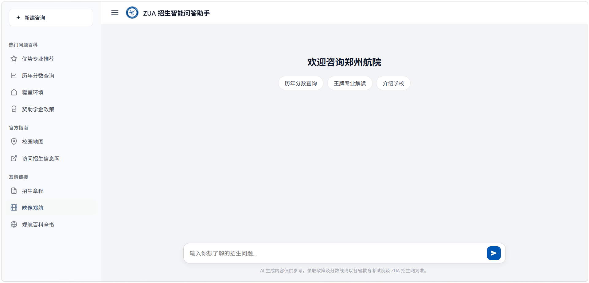

# ZUA 招生咨询助手

郑州航空工业学院招生智能问答系统 —— 基于 RAG（检索增强生成）+ 多路数据查询的 AI 招生咨询平台。

## 功能特性

- **智能意图识别**：自动判断用户问题是查分数、查专业、查政策还是闲聊
- **多路数据检索**：
  - **LanceDB 向量库**：校园政策、宿舍、军训、转专业等文本语义检索（本地内置，开箱即用）
  - **MySQL 关系库**：全国各省历年录取分数查询（可选，Text-to-SQL）
  - **Neo4j 图谱库**：学院、专业、特色知识图谱查询（可选，Text-to-Cypher）
- **流式对话输出**：基于 SSE（Server-Sent Events）的逐 token 实时输出，打字机效果
- **会话持久化**：对话记录自动保存到磁盘，重启不丢失
- **管理面板**：数据统计、会话查看、系统日志、文件管理、系统状态等

## 系统架构

```
用户提问
  │
  ▼
┌─────────────────┐
│  意图路由        │  自动识别意图
│  (Intent Router) │
└───────┬─────────┘
        │
   ┌────┴────┬──────────┐
   ▼         ▼          ▼
┌──────┐ ┌──────┐ ┌──────────┐
│LanceDB│ │MySQL │ │  Neo4j   │
│向量库 │ │分数库│ │ 知识图谱  │
└──┬───┘ └──┬───┘ └────┬─────┘
   │        │          │
   └────┬───┴──────────┘
        ▼
┌─────────────────┐
│  qwen-plus      │  基于检索结果生成回答
│  生成回答       │
└─────────────────┘
```

## 效果展示

| 主界面 |
|:---:|
|  | 

> 更多截图见 `docs/images/` 目录。

## 目录结构

```
zua-chatbot/
├── .env.example           # 配置文件模板
├── .gitignore
├── requirements.txt       # 核心依赖（必需）
├── requirements-db.txt    # 数据库依赖（可选）
├── start.sh               # 一键启动脚本
├── README.md              # 本文件
│
├── data/                  # 原始数据
│   ├── data.md            # 校园政策 Markdown → 向量库
│   ├── data.txt           # 校园政策原始文本
│   ├── xueyuan.md         # 学院专业信息 → 知识图谱
│   ├── xueyuan.txt        # 学院信息原始文本
│   └── csv/               # 各省历年录取分数 CSV
│
├── database/              # 数据库初始化脚本（独立模块）
│   ├── __init__.py
│   ├── build_vector_db.py # 构建 LanceDB 向量库
│   ├── sql/
│   │   ├── __init__.py
│   │   └── import_csv_to_mysql.py  # CSV → MySQL
│   └── neo4j/
│       ├── __init__.py
│       └── txt_2_neo4j.py          # 文本 → Neo4j 图谱
│
├── utils/                 # 后端核心代码
│   ├── __init__.py
│   ├── main.py            # FastAPI 主应用（路由、API、管理面板）
│   ├── config.py          # 统一配置管理
│   ├── feedback.py        # 反馈统计模块
│   └── zua_lancedb/       # LanceDB 向量数据（已预构建）
│
├── static/                # 前端静态文件
│   ├── index.html         # 主页面
│   ├── app.js             # 前端逻辑
│   ├── style.css          # 样式文件
│   └── img.png            # AI 助手头像
│
└── docs/                  # 文档与截图
    └── images/            # 界面截图
```

## 环境要求

- **Python** >= 3.10
- **MySQL** >= 5.7（可选，存储历年录取分数）
- **Neo4j** >= 4.4（可选，存储专业知识图谱，可用免费的 [Neo4j Aura](https://neo4j.com/cloud/aura-free/)）
- **阿里云通义千问 API Key**（必填，用于对话生成和文本向量化）

## 安装与部署

### 1. 获取项目

```bash
# 从 ZIP 包解压
unzip zua-chatbot.zip
cd zua-chatbot

# 或从 git 仓库克隆
git clone https://github.com/toriae/ZUA_RAG_QA.git -b feature/delivery
cd ZUA_RAG_QA
```

### 2. 创建虚拟环境（推荐）

```bash
# Windows
python -m venv venv
venv\Scripts\activate

# macOS / Linux
python3 -m venv venv
source venv/bin/activate
```

### 3. 安装依赖

```bash
# 安装核心依赖（即可运行聊天功能）
pip install -r requirements.txt

# 如需启用 MySQL / Neo4j 功能，额外安装：
pip install -r requirements-db.txt
```

## 配置说明

所有配置通过 `.env` 文件管理。首先复制模板：

```bash
cp .env.example .env
```

编辑 `.env` 文件，**至少填写 `ZUA_API_KEY`**：

| 环境变量 | 说明 | 必填 |
|---------|------|------|
| `ZUA_API_KEY` | 通义千问 API Key | 是 |
| `ZUA_BASE_URL` | API 地址，默认 DashScope | 否 |
| `ZUA_ADMIN_PASSWORD` | 管理面板密码，默认 `admin123` | 否 |
| `ZUA_MYSQL_URI` | MySQL 连接字符串 | 可选 |
| `ZUA_NEO4J_URI` | Neo4j 连接地址 | 可选 |
| `ZUA_NEO4J_USER` | Neo4j 用户名 | 可选 |
| `ZUA_NEO4J_PASSWORD` | Neo4j 密码 | 可选 |

> **获取 API Key**：前往 [阿里云百炼平台](https://bailian.console.aliyun.com/) 注册并创建 API Key。
> 需要开通的模型：`qwen-plus`（对话）、`text-embedding-v4`（向量化）。

## 启动服务

### 方式一：一键启动脚本

```bash
# Linux / macOS
chmod +x start.sh
./start.sh

# Windows
start.bat
```

### 方式二：直接运行

```bash
python3 -m uvicorn utils.main:app --host 0.0.0.0 --port 8012
```

启动成功后访问：
- **前端页面**：http://localhost:8012
- **管理面板**：http://localhost:8012/v1/admin

## 数据库说明

项目采用**数据库分离架构**：核心应用（聊天对话）仅依赖本地 LanceDB 向量库，已预构建并随项目分发，开箱即用。MySQL 和 Neo4j 作为可选的外部数据库，需要单独安装和配置。

### 核心数据库（内置，开箱即用）

| 数据库 | 用途 | 说明 |
|--------|------|------|
| **LanceDB** | 政策文本向量检索 | 嵌入式本地库，数据已预构建在 `utils/zua_lancedb/`，无需额外服务 |

安装完核心依赖即可使用，无需任何额外配置。

### 可选数据库（需自行部署）

| 数据库 | 用途 | 说明 |
|--------|------|------|
| **MySQL** | 历年录取分数查询 | 需安装 MySQL 服务并导入数据 |
| **Neo4j** | 学院专业知识图谱 | 需安装 Neo4j 服务并构建图谱 |

### 数据库初始化

如需启用 MySQL 或 Neo4j 功能，按以下步骤操作：

```bash
# 1. 安装数据库依赖（如果还没装）
pip install -r requirements-db.txt

# 2. 部署并启动对应的数据库服务

# 3. 在 .env 中填写数据库连接信息

# 4. 运行初始化脚本
python3 -m database.sql.import_csv_to_mysql   # 导入分数数据到 MySQL
python3 -m database.neo4j.txt_2_neo4j         # 构建知识图谱到 Neo4j
```

如果不需要重新构建向量库（已预构建），可跳过。如需重建：

```bash
python3 -m database.build_vector_db
```

## 管理面板功能

访问 `/v1/admin` 输入管理员密码后可使用：

| 模块 | 功能 |
|------|------|
| 数据统计 | 总提问数、命中率、热门意图、未命中查询 |
| 会话记录 | 查看所有用户对话历史，支持详情查看（数据持久化，刷新不丢失） |
| 系统日志 | 按级别筛选查看服务运行日志 |
| 文件管理 | 在线编辑 data.md、.env、config.py |
| 数据库 | MySQL 可视化查询，支持表名快捷 |
| 系统状态 | CPU、内存、磁盘等实时监控 |
| 服务控制 | 查看/重启/停止服务状态 |
| 安全设置 | 修改管理面板密码 |

## API 接口

后端暴露一个兼容 OpenAI 格式的接口：

```
POST http://localhost:8012/v1/chat/completions
Content-Type: application/json

{
  "model": "default",
  "messages": [{"role": "user", "content": "你们学校有哪些航空特色专业？"}],
  "temperature": 0.2,
  "stream": true
}
```

| 路径 | 方法 | 说明 |
|------|------|------|
| `/` | GET | 前端主页面 |
| `/v1/chat/completions` | POST | 聊天对话接口（支持 SSE 流式） |
| `/v1/admin` | GET | 管理面板 |
| `/v1/admin/sessions` | GET | 获取会话列表 |
| `/v1/admin/sessions/{id}` | GET | 获取单条会话详情 |
| `/v1/stats` | GET | 统计信息 |
| `/v1/health` | GET | 服务健康检查 |
| `/v1/admin/logs` | GET | 系统日志 |
| `/v1/admin/system` | GET | 系统状态 |
| `/v1/admin/service/status` | GET | 服务运行状态 |

## 技术栈

| 组件 | 技术 |
|------|------|
| 后端框架 | FastAPI + Uvicorn |
| 大模型 | 通义千问 qwen-plus（OpenAI 兼容 API） |
| 向量化 | text-embedding-v4 |
| 向量数据库 | LanceDB（嵌入式本地库，零配置） |
| 关系数据库 | MySQL（可选，SQLAlchemy + PyMySQL） |
| 图数据库 | Neo4j（可选） |
| 文本切分 | 按 Markdown 一级标题分块，语义完整性更好 |
| 前端 | 原生 HTML/CSS/JS |
| 会话存储 | JSON 文件持久化 |

## 常见问题

### Q: 启动后提示 "ZUA_API_KEY 未配置"

A: 请确保 `.env` 文件中 `ZUA_API_KEY` 填写了有效的 API Key。

### Q: 修改了 data.md 后需要重新构建向量库吗

A: 是的。修改后重新运行 `python3 -m database.build_vector_db`，确保 `data/data.md` 文件存在。

### Q: 分数查询功能不工作

A: 需要单独安装 MySQL 服务，填写 `.env` 中的 `ZUA_MYSQL_URI`，并运行 `python3 -m database.sql.import_csv_to_mysql` 导入数据。

### Q: 专业图谱查询不工作

A: 需要单独安装 Neo4j 服务，填写 `.env` 中的 Neo4j 配置，并运行 `python3 -m database.neo4j.txt_2_neo4j` 构建知识图谱。如果使用 Neo4j Aura，确认实例未过期（免费实例 30 天不活跃会暂停）。

### Q: 政策咨询功能不工作

A: 检查 `utils/zua_lancedb` 目录是否存在，如缺失请运行 `python3 -m database.build_vector_db` 重建向量库。

### Q: 大模型 API 报错

A: 确认 API Key 有效且余额充足。确认已开通 `qwen-plus` 和 `text-embedding-v4` 模型。前往 [阿里云百炼平台](https://bailian.console.aliyun.com/) 检查模型开通状态。

### Q: 如何更新录取分数数据

A: 将新的 CSV 文件放入 `data/csv/` 目录，然后重新运行 `python3 -m database.sql.import_csv_to_mysql`。

## 致谢

- [阿里云百炼平台](https://bailian.console.aliyun.com/) — 提供大模型 API
- [LanceDB](https://lancedb.com/) — 轻量级本地向量数据库
- [Neo4j](https://neo4j.com/) — 图数据库

